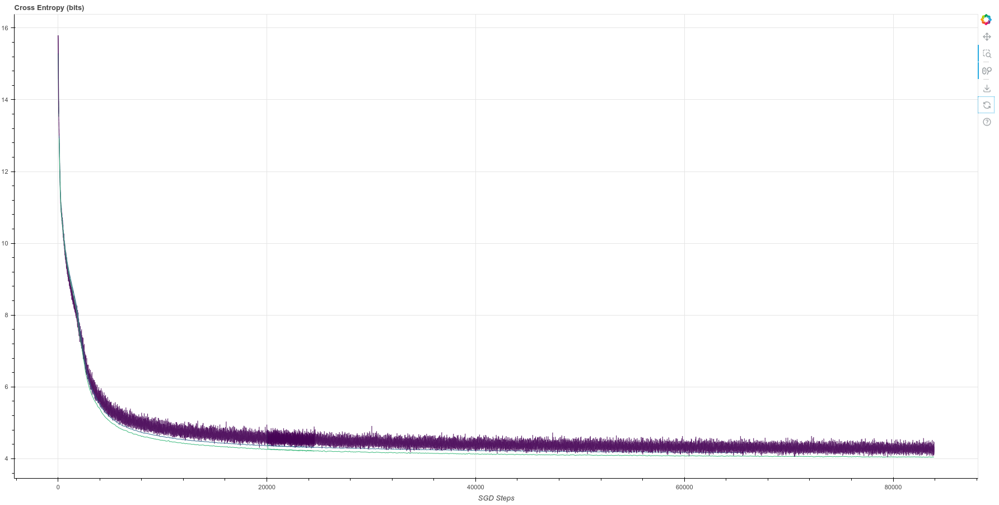
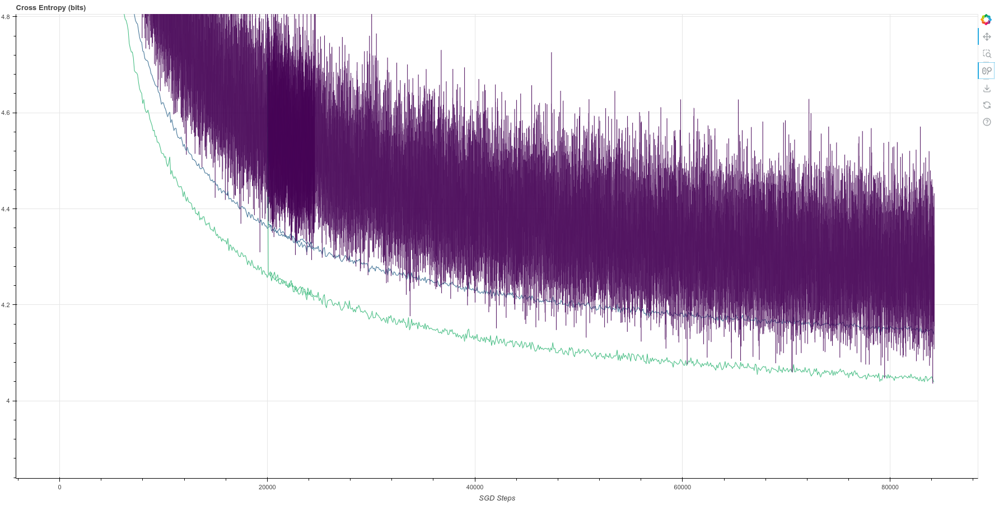
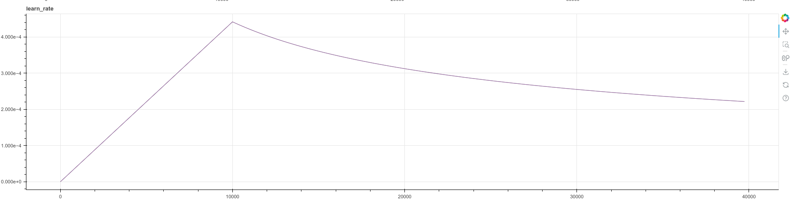

# Introduction

An original implementation of the paper [Attention is All You
Need](https://arxiv.org/pdf/1706.03762.pdf) by Vaswani et al.





Shown above is a training run for about 12 epochs.  Purple line is the training cross
entropy.  Blue line is the validation cross-entropy on newstest2013, evaluated every
100 SGD steps.  The lower, green line is also validation cross-entropy loss, but
using a model without dropout.  Batch size about 25,000 target tokens.  Training is
on the whole (4.5M sentence pairs) WMT-14 database.  96 sentence-pairs in each batch, 62,500
steps per epoch. Training is on TPU.



The learning rate schedule is as given in the paper, section 5.3, page 7, equation 3.

```python
def make_learning_rate_fn(warmup_steps, M):
    # from section 5.3, page 7, equation 3
    def lr_fn(step):
        factor = jax.lax.min(step ** -0.5, step * warmup_steps ** -1.5)
        new_lr = M ** -0.5 * factor
        # jax.debug.print('learn_rate: {}', new_lr)
        return new_lr
```

# Getting Started

## Introduction

This repo is written using Jax and Haiku, and tested using Google Colab TPU.  On the
German-English dataset, consisting of 4.5 million sentence pairs, the model trains to
100k steps in about 16 hours.  It achieves a Bleu score around 25.0, which is near
the reported value of 27.3 in the paper.

I tried to stay as close as possible to the original architecture.  However, there is
one major change which is that I used Pre-LN instead of the original Post-LN.

## Installation

Install the package with:

    pip install git+https://github.com/hrbigelow/transformer-aiayn.git

## Training the BPE Tokenizer

Train a byte-pair encoded (BPE) tokenizer on English-German sentence pair dataset.
The first time this is launched, the dataset will be downloaded to `DOWNLOAD_DIR`.
Subsequent times will use the cached data stored there.

You must choose the desired vocabulary size.  Other datasets can be found with
`tfds.list_builders()`.

NOTE:  It is ultimately much faster to run this and the next command locally rather
than using the combination of Colab and Google Cloud Storage.  Once the dataset is
downloaded locally, training the tokenizer takes about 2 minutes.  Whereas, my
attempt to train it on Colab using the dataset downloaded to a GCS bucket ran for
over 40 minutes without finishing.  Also, HuggingFace's progress meter doesn't work
in Colab, but it works when running locally.

```bash
# python aiayn/preprocess.py DOWNLOAD_DIR DATASET_NAME VOCAB_SIZE OUT_FILE
python aiayn/preprocess.py train_tokenizer \
  ~/tensorflow_datasets \
  huggingface:wmt14/de-en \
  36500 \
  de-en-bpe.36500.json
```

## Tokenizing the dataset

Now that you have a trained tokenizer (the `tokenizer_file`), use it to convert the
text-based sentence-pair dataset into token sequences (integer arrays) and save them
to tf.record files. It is considered best practice to save this dataset in multiple
shards. This somehow simplifies the process of parallelized reads during training.
Since TPUs are so fast, it is actually somewhat common for the bottleneck to be data
loading speed.

Perform this step for both the `train` and `validation` splits of the dataset.

```bash
# python aiayn/preprocess.py tokenize_dataset DOWNLOAD_DIR DATASET_NAME SPLIT \
#   TOKENIZER_FILE NPROC NUM_SHARDS OUT_TEMPLATE INPUT_LANG TARGET_LANG 
python aiayn/preprocess.py tokenize_dataset \
   ~/tensorflow_datasets huggingface:wmt14/de-en train de-en-bpe.36500.json \
   8 ~/de-en-train/{}.tfrecord en de
```

Once finished, upload the `.tfrecord` files to Google Cloud Storage using `gcloud
storage cp` command.  You will need to set things up with Google Cloud.

NOTE:  I have also tried using gdrive for the persistence.  It is possible to mount
it into a Colab.  However, it is not as reliable or performant and I do not recommend
it, even though the initial setup with GCS takes some work.

## Train the model

Train the Encoder-Decoder model (design based on Attention Is All You Need) on the
data.  The settings below work for a TPU.  

[](https://colab.research.google.com/github/hrbigelow/transformer-aiayn/blob/master/notebooks/jax_aiayn.ipynb)

```bash
python3 aiayn/train.py \
  --dataset_glob 'de-en-train/*.tfrecord' \
  --val_dataset_glob 'de-en-val/*.tfrecord' \
  --batch_dim0 96 \ # Total number of sentence-pairs per SGD batch
  --accum_steps 2 \ # Number of gradient accumulation steps
  --ckpt_every 3000 \ 
  --eval_every 100 \    # Compute scores on validation dataset every __ steps
  --val_loop_elem 32 \ # Process this many validation sentence pairs per loop
  --ckpt_dir ~/checkpoints \
  --resume_ckpt None \ # Supply an integer here to resume from a saved checkpoint
  --report_every 10 \   # Interval for print metrics to stdout
  --max_source_len 320 \  # maximum length in tokens for source sentences
  --max_target_len 320 \  # maximum length in tokens for target sentences
  --swap_source_target True \ # If true, swap the source and target sentences
  --shuffle_size 100000 \     # Buffer size for randomizing data element order
  --label_smooth_eps 0.1 \    # Factor for mixing in a uniform distribution to labels
  --tokenizer_file de-en.bpe.36500.json
# --streamvis_run_name test \ # Scoping name for visualizing data from different runs
# --streamvis_path svlog \    # Log file for logging visualization data
# --streamvis_buffer_items 100 # How many logging data points to visualize
```

## Run the model

Run the trained model on some input sentences, in this case `newstest2013.en` and
write the translation results to `results.out`.  It is crucial that
`pos_encoding_factor` is set to the same value as was used for training.  (In fact,
it should instead be saved as part of the model checkpoint).

```bash
python3 aiayn/sample.py sample \
 --ckpt_dir checkpoints \
 --resume_ckpt 85000 \
 --tokenizer_file de-en.bpe.36500.json \
 --batch_file newstest2013.en \ 
 --out_file results.out \
 --batch_dim0 64 \
 --max_source_len 150 \
 --max_target_len 150 \
 --random_seed 12345 \
 --beam_size 4 \
 --beam_search_beta 0.0 \
 --pos_encoding_factor 1.0
```

## Evaluate the results

```bash
python3 aiayn/sample.py evaluate newstest2013.de results.out
```

## Notes

`batch_dim0` is so-named in order to emphasize that it is just one dimension of the
the actual batch, which are individual tokens from each target sentence.  The
original 'base model' paper trained with ~25,000 target tokens per batch.  With a
`max_target_len` of 320 and 96 sentences in a batch, this leaves a maximum room of
30,720 target tokens.  However, tokens are packed, and an average occupancy of
the packed data is around 25,000.

When training on a TPU for technical reasons, the quantity `batch_dim0 / accum_steps`
must be evenly divisible by the number of cores (8 on a TPU).  In the example above,
that quantity is 48.  This means that each core handles a batch of 6 sentence pairs
for each of two gradient accumulation steps.

Memory consumption of attention modules is N^2 with context.  With a TPU v3 memory, a
context of 320 fits well and is sufficient to cover quite long sentences in the
training set.  

The validation dataset provided in `val_dataset_glob` is loaded entirely into memory,
so it is expected to be a few thousand examples.  During training, every `eval_every`
SGD steps, this entire set is evaluated twice - once with a 'training mode' model
(the same model that is training using SGD) and the second is the 'testing mode'
model - one without dropout enabled.  The validation dataset is evaluated in batches of
`val_loop_elem`, which should just be set to as high a number as can fit in the
device memory.

