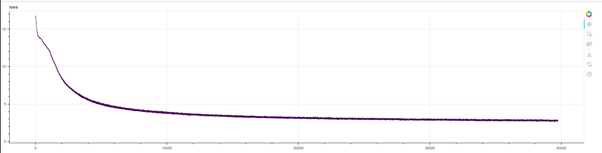

# Introduction

An original implementation of the paper [Attention is All You
Need](https://arxiv.org/pdf/1706.03762.pdf) by Vaswani et al.



Shown above is a training run for about half of an epoch.  batch size 50,000 (number
of input plus output tokens) on the whole (4.5M samples) WMT-14 database.  720
sentence-pairs in each batch, 62500 steps per epoch. Training is on TPU.


Perplexity here is computed as 2 ^ entropy, given for both model (red) and dataset
(green).


The learning rate schedule is as given in the paper, section 5.3, page 7, equation 3.

```python
def make_learning_rate_fn(warmup_steps, M):
    # from section 5.3, page 7, equation 3
    def lr_fn(step):
        factor = jax.lax.min(step ** -0.5, step * warmup_steps ** -1.5)
        new_lr = M ** -0.5 * factor
        # jax.debug.print('learn_rate: {}', new_lr)
        return new_lr
```


## Getting Started

    pip install git+https://github.com/hrbigelow/transformer-aiayn.git

    # download and prepare the WMT14 dataset
    python -m aiayn.data \
      --cache_dir ~/ai/data/.cache \
      --data_dir ~/ai/data/wmt14 \
      --num_proc 8

    # pass the --shard option to prepare only a fraction of it:
    python -m aiayn.data \
      --cache_dir ~/ai/data/.cache \
      --data_dir ~/ai/data/wmt14 \
      --num_proc 8 \
      --shard '(100, 5)'

    # train the model
    python -m aiayn.train \
      None \
      --data_path ~/ai/data/wmt14 \
      --batch_size 64 \
      --update_every 4 \
      --ckpt_every 500 \
      --ckpt_templ ~/ai/ckpt/aiayn/may28-run{}.ckpt \
      --report_every 10 \
      --max_sentence_length 25 \
      --pubsub_project $PROJECT_ID \
      --pubsub_topic aiayn \
      --streamvis_run_name may26-tpu


