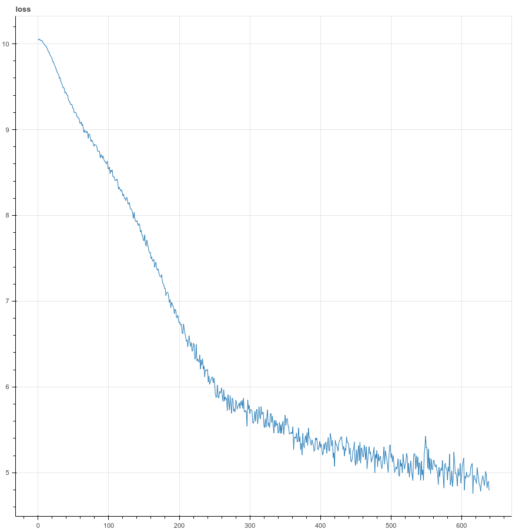

# Introduction

An original implementation of the paper [Attention is All You
Need](https://arxiv.org/pdf/1706.03762.pdf) by Vaswani et al.

Shown above is loss using batch size 2048 on the whole (4.5M samples) WMT-14 dataset.
It represents about a half an epoch.  Training is on TPU.

